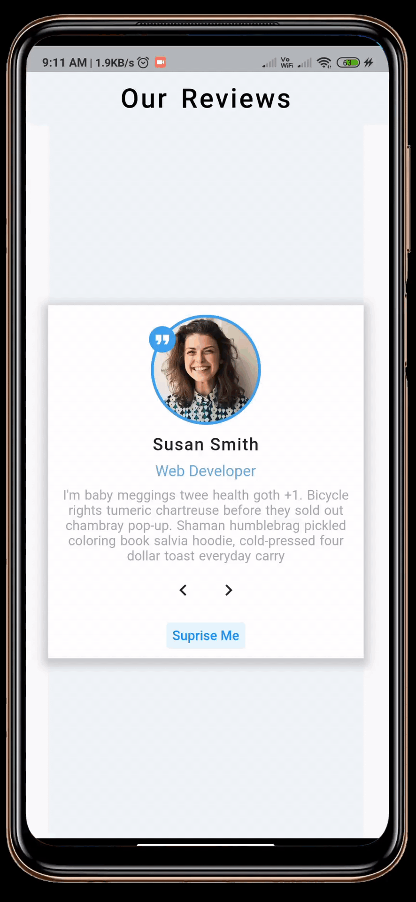

[](https://github.com/gadgetvala/flutter_refresher_projects)
[](https://github.com/gadgetvala/flutter_refresher_projects/issues)
[](https://www.linkedin.com/in/gadgetvala/)

# Introduction

> “ flutter_refresher_projects ”
> is repo of serveral small project to demonstrate & recall flutter usage.

Apps :

1. Birthday_Remindar


2. Tours


3. Review_Info


4. Accordion


5. Menu


6. Tabs


7. Lorem_Ipsum


8. Color_Generator


9. Grocery_Bud


## :bulb: Key Features

- [x] Show Netowrk Image.
- [x] Set State with new Data.
- [x] Sleek Design.
- [x] State Management.
- [x] Form Validation.
- [x] Form State Handling.
- [x] Dynamic State Updation & Rendring.

## 🚀 &nbsp;Installation

To clone and run this application, you'll need [Git](https://git-scm.com) and [Flutter](https://flutter.dev/docs/get-started/install) installed on your computer. From your command line:

```bash
# Clone this repository
$ git clone https://github.com/gadgetvala/flutter_refresher_projects.git

# Go into the repository
$ cd flutter_refresher_projects/{Any project you want}

# Install dependencies
$ flutter packages get

# Run the app
$ flutter run
```

### Packages

Some very good packages are used in the project, not a big list.
Below are the information about these packages.

| package                                                                   | explain             |
| ------------------------------------------------------------------------- | ------------------- |
| [uuid](https://pub.dev/packages/uuid)                                     | Generate Unique IDs |
| [dio](https://pub.dev/packages/dio)                                       | Network Calls       |
| [flutter_launcher_icons](https://pub.dev/packages/flutter_launcher_icons) | App Icon Generator  |

## :clap: Done

Feel free to **file a new issue** with a respective title and description on the the [flutter_refresher_projects](https://github.com/gadgetvala/flutter_refresher_projects/issues) repository. If you already found a solution to your problem, **I would love to review your pull request**!

## 📘&nbsp; License

Free, Hell Yeah!!

## :heart: Contributor

Made by [Suraj Verma](https://github.com/gadgetvala)
